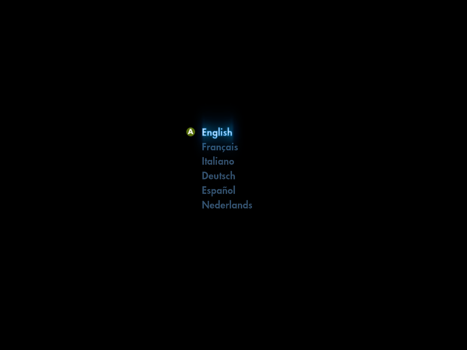
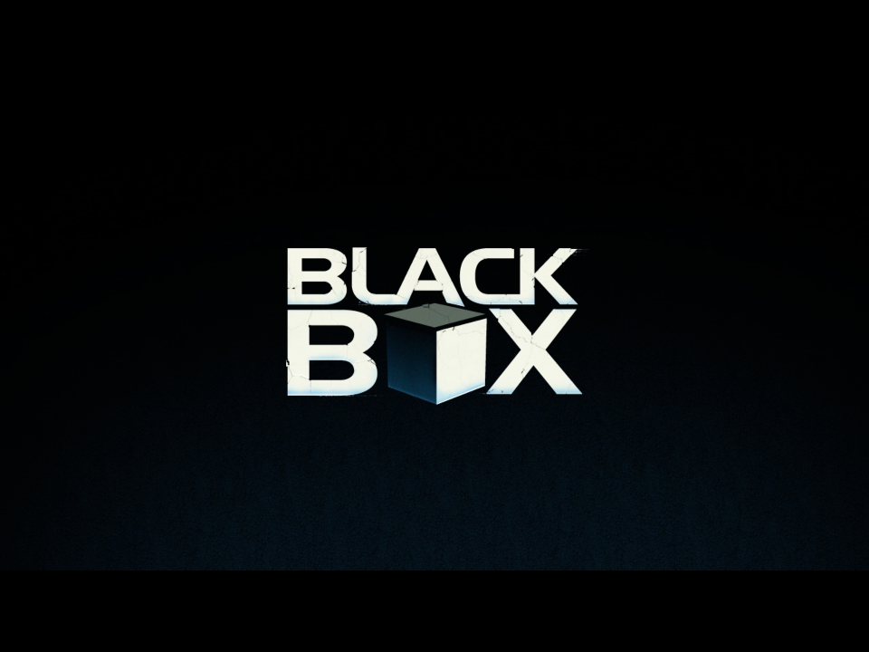
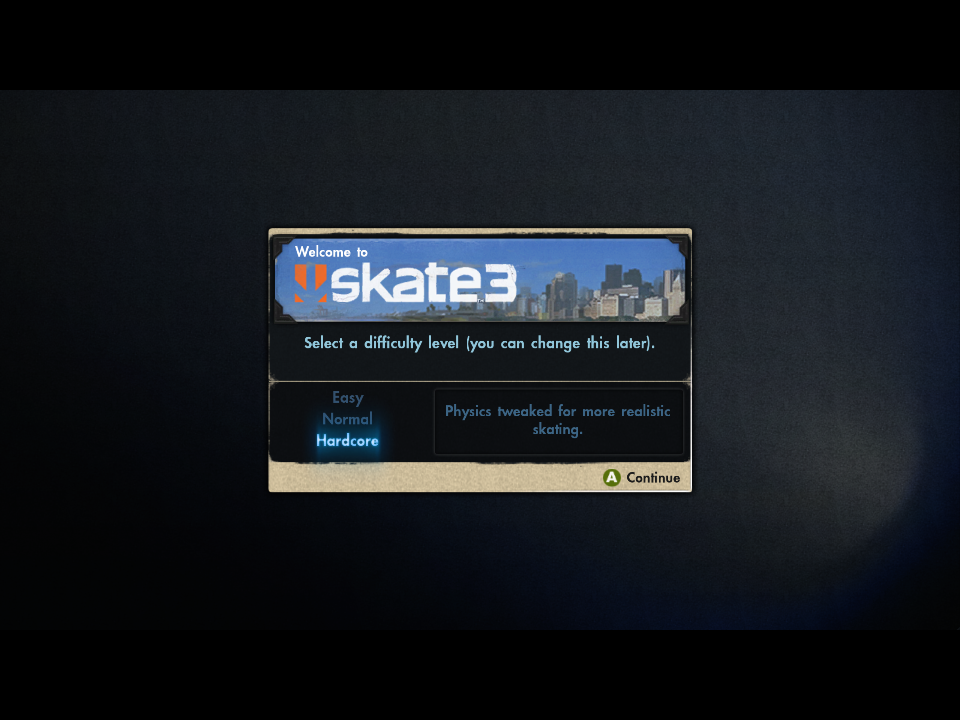

<h1 align="center">🛹 Skate 3 — Android (aarch64) Port</h1>

<p align="center">
  <b>A native ARM64 Android port of Skate 3</b> — not an emulator.<br>
  The Xbox 360 game is statically recompiled to native machine code and runs directly on the device.
</p>

<p align="center">
  
  
  
  
</p>

---

## What this is

This is an **Android build** of [`skate3recomp`](https://github.com/mchughalex/skate3recomp) — a static
recompilation of the Xbox 360 version of Skate 3. The PowerPC game code is translated to C++ and compiled
to **native aarch64**, so the CPU side runs as real ARM machine code (no instruction emulation). Graphics
go through a **Vulkan** backend; windowing, input and audio through **SDL3**.

It targets handhelds like the **Anbernic RG406V** (Unisoc T820, Mali‑G57, Android 13). It boots, loads
saves, takes controller input, and renders the game. GPU performance on Mali is still a work in progress
(see [Status](#status)).

> ⚠️ **No game files are included.** You must provide your own legally‑dumped copy of Skate 3 (Xbox 360).

## Screenshots

<p align="center">
  
  
  
</p>
<p align="center"><i>Language select · intro playback (FFmpeg/VP6) · difficulty select — all rendering natively via Vulkan on Mali‑G57.</i></p>

## Status

| Area | State |
|---|---|
| Boot / front-end / menus | ✅ Works |
| Save data | ✅ Loads |
| Controller (built-in gamepad) | ✅ Works (SDL3 mapping) |
| Cutscene video (VP6/FFmpeg) | ✅ Plays |
| In-world rendering | ✅ Renders, ⚠️ ~10 fps + intermittent black frames on Mali |
| Audio | ⚠️ Partial (XMA decoder issues) |
| Performance | 🚧 Active work — GPU-bound on the EDRAM→Vulkan resolve path on tile GPUs |

The remaining work is a focused **GPU performance effort**: the Xbox 360's on-chip EDRAM is emulated by
resolving render targets through main memory, which is the worst case for a tile-based mobile GPU. The
Mali‑G57 *does* support `VK_EXT_rasterization_order_attachment_access`, so a tile-local render-target path
is viable — that's the headline optimization being pursued.

## Hardware target

- **Device:** Anbernic RG406V (and similar Unisoc T820 / Mali‑G57 handhelds)
- **OS / ABI:** Android 13+, `arm64-v8a`
- **GPU:** ARM Mali‑G57 (Vulkan 1.3)

## Building

You need the **Android NDK r27**, **CMake + Ninja**, a host **Clang** (e.g. Homebrew `llvm`), **JDK 17**,
and your own extracted Skate 3 game dump. The build has two stages: a host-side code-generation pass
(recompiles the game to C++), then the cross-compile to `arm64-v8a`.

```sh
git clone --recurse-submodules https://github.com/Buku313/Skate3-Android.git
cd Skate3-Android

# 1. Extract default.xex + EAWebkit.xex from YOUR legally-dumped ISO into game/
python3 android/tools/extract_xiso.py /path/to/Skate3.iso game \
        default.xex data/webkit/EAWebkit.xex

# 2. Host codegen + cross-compile the native libs + stage them into the APK project
export ANDROID_NDK_ROOT=$HOME/Library/Android/sdk/ndk/27.2.12479018
android/tools/build_android_libs.sh

# 3. Build the APK
cd android
export JAVA_HOME=$(brew --prefix openjdk@17)/libexec/openjdk.jdk/Contents/Home
./gradlew assembleDebug
```

Output: `android/app/build/outputs/apk/debug/app-debug.apk`.

See [`android/README.md`](android/README.md) for the native-library layout and details.

## Installing + game data

```sh
adb install -r android/app/build/outputs/apk/debug/app-debug.apk

# Push the FULL extracted game data (~7 GB) to where the app looks for it:
android/tools/install_game_data.sh /path/to/Skate3.iso     # extracts + adb push to /sdcard/skate3/

# Grant "All files access" so it can read the dump:
#   Settings → Apps → Skate 3 → Permissions → All files access
```

## Performance tuning

Drop [`android/skate3-maxperf.toml`](android/skate3-maxperf.toml) into the app's config and toggle the
experimental cvars. `android/tools/perf_probe.sh on|dump` captures on-device GPU bucket timings,
render-pass counts, and resolve stats for profiling.

## How it works

```
Xbox 360 default.xex ──(host codegen)──▶ generated C++ ──(NDK clang)──▶ libskate3.so (native aarch64)
                                                                              │ links
                          librexruntime.so  (Xenia-derived runtime: PPC→C++ glue, kernel,
                          SDL3 + Vulkan + FFmpeg) ◀───────────────────────────┘
                                                                              │ loaded by
                                              SDLActivity (APK)  ──▶ SDL_main ──▶ game
```

## Credits

- **[skate3recomp](https://github.com/mchughalex/skate3recomp)** and the **rexglue SDK** — the
  recompilation this port is built on.
- **[Xenia](https://xenia.jp/)** — the GPU/kernel emulation lineage the runtime derives from.
- **[SDL3](https://libsdl.org/)**, **[FFmpeg](https://ffmpeg.org/)**, **Vulkan / volk / VMA**.

## Legal

This project contains **no game code or assets**. Skate 3 is © Electronic Arts. You must own and dump
your own copy. This is a non-commercial, fan-made compatibility/port effort distributed in the same
spirit as the upstream recompilation.
