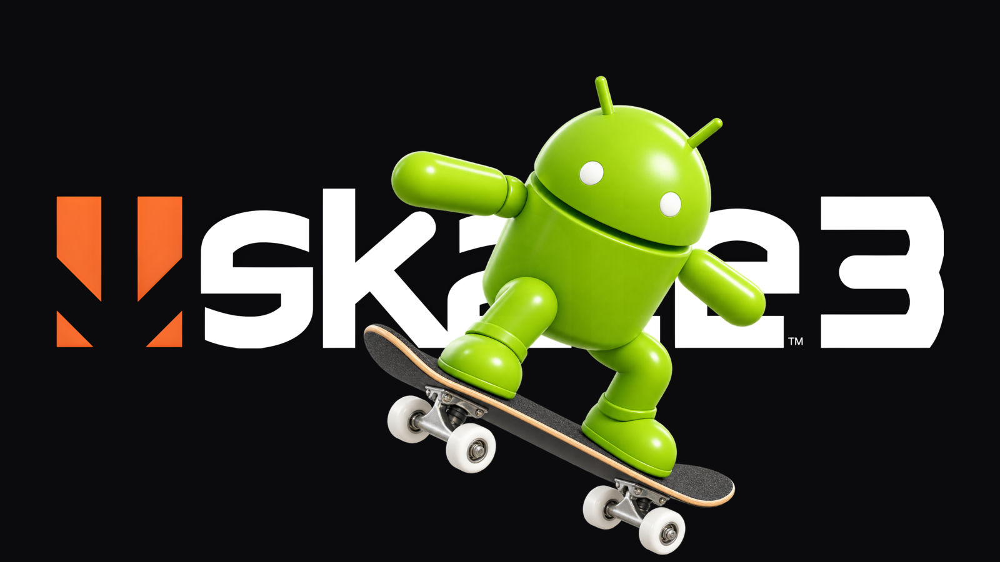

# SKATE 3 ANDROID

<p align="center">
  
</p>

Skate 3 running as native ARM64 code on Android through static recompilation.
This is not an Xbox 360 emulator.

The Android port is experimental, but it is playable on the Anbernic RG406V.
It uses the native Vulkan renderer from Skate3Recomp with Android input, audio,
storage, performance profiles, and handheld tuning added in this fork.

No retail game files are included. You must provide your own legally obtained
copy of Skate 3 and Title Update 3.

## Current status

- Boots into the game
- Menus and controller input work
- Gameplay and tricks work
- Native Vulkan rendering works
- Saves and game data load from Android storage
- RG406V performance profile included
- High-end Android quality profile included
- Optional Seiyu Paradise Penguin Mod included
- Experimental direct-IP free-skate ghost included and disabled by default

This is still early. Expect visual bugs, missing effects, device-specific
problems, and performance differences between phones.

## Device requirements

- Android 13 or newer
- ARM64
- ARMv8.2 with FP16 and dot-product support
- Vulkan support
- A physical controller or built-in gamepad

The RG406V with the Unisoc T820 and Mali-G57 is the first verified device.
Newer Snapdragon and Adreno devices are good candidates, but they have not all
been tested.

## Graphics profiles

The same APK includes both profiles.

### RG406V / Performance

- 512x288 internal 3D scene
- Full-resolution menus and HUD
- Reduced world and LOD range
- Simplified materials
- Grass and expensive post effects disabled
- 60 FPS guest cap

### High-End / Quality

- 1280x720 internal 3D scene
- Original world and LOD range
- Vegetation and full material layers
- 2x MSAA
- Shadows, SSAO, bloom, and volumetric lighting
- 60 FPS guest cap

Open the recomp menu with **RB + Start**. Go to **Video**, select **Android
Device Profile**, then use **Apply & Restart**.

## Game data

The app reads game data from:

```text
/sdcard/skate3/
```

Copy your own extracted Skate 3 files into that folder. Full build and setup
instructions are in [android/README.md](android/README.md).

## Build

You need Android SDK 35, Android NDK r27c, JDK 17, CMake, Ninja, Clang, your
extracted game dump, and Title Update 3.

```sh
git clone --recursive https://github.com/Buku313/Skate3-Android.git
cd Skate3-Android
export ANDROID_NDK_ROOT=/path/to/android-sdk/ndk/27.2.12479018
android/tools/build_android_libs.sh
cd android
./gradlew assembleDebug
```

The APK is written to:

```text
android/app/build/outputs/apk/debug/app-debug.apk
```

## SEIYU PARADISE PENGUIN MOD

Place the user-supplied Seiyu model and texture here:

```text
/sdcard/skate3/mods/penguin/base.obj
/sdcard/skate3/mods/penguin/texture_diffuse.png
```

The mod rigs Seiyu to the live skater skeleton and keeps the skateboard visible.
The model and texture are not included in this repository.

## Credits

### Alex McHugh, mchughalex

[Alex McHugh](https://github.com/mchughalex) created and maintains the upstream
[Skate3Recomp](https://github.com/mchughalex/skate3recomp) project and the
[Skate-specific rexglue runtime](https://github.com/mchughalex/rexglue-skate3).
His work is the foundation of this project, including the static recompilation
pipeline, native renderer, game integration, settings, tools, and a huge amount
of reverse engineering. The original commits and authorship are preserved in
this repository.

### Buku313 / Antonio Seevers

This fork contains the Android ARM64 port, SDL Android integration, RG406V
bring-up and optimization, Android graphics profiles, the Seiyu Paradise
Penguin Mod, and the experimental free-skate networking work.

### Projects used

- [rexglue SDK](https://github.com/rexglue/rexglue-sdk)
- [Xenia](https://github.com/xenia-project/xenia)
- [SDL](https://github.com/libsdl-org/SDL)
- [Vulkan](https://www.vulkan.org/)
- [FFmpeg](https://ffmpeg.org/)

Thank you to everyone whose Xbox 360 research, testing, bug reports, and open
source work made this possible.

## Legal

This is an unofficial fan project. It is not affiliated with Electronic Arts,
Black Box, Microsoft, Google, or the Android project.

Skate 3, its characters, names, and related assets belong to their respective
owners. Android is a trademark of Google LLC. This repository does not contain
the game, title update, DLC, generated game code, or other copyrighted retail
data.
